# ApplyWise

ApplyWise is a robust web application designed to streamline the job application process for users. It empowers individuals to take control of their job applications, providing a user-friendly platform with a range of features that enhance the application experience.

[View Applywise live website here](https://applywise-f12ef2315c63.herokuapp.com/)

- - -

## Table of Contents
### [User Experience](#user-experience-ux)
* [Project Goals](#project-goals)
* [Agile Methodology](#agile-methodology)
* [User Stories](#user-stories)
* [First time user](#first-time-user)
* [Registered user](#registered-user)
* [Admin user](#admin-user)
### [Design](#design-1)
* [Color Scheme](#color-scheme)
* [Data Model](#data-models)
* [Database Scheme](#database-scheme)
### [Security Features](#security-features-1)
### [Features](#features-1)
* [Existing Features](#existing-features)
* [Features Left to Implement](#features-left-to-implement)
- - -
## User Experience (UX)

### Project Goals
ApplyWise was designed to streamline job application management, empowering users to efficiently track and organize job applications within a single platform. The application aims to provide an intuitive, user-friendly experience that simplifies the job search process for individuals and enhances their ability to manage and monitor progress effectively.

### Agile Methodology

The Agile Methodology was employed to effectively prioritize and organize tasks, structure user stories, and manage the project workflow using GitHub Project Boards. To streamline the creation of user stories and define epics, a custom template was developed, enabling consistency and clarity across all project planning efforts.
* Epics were written containing possible user stories and based on that the website was made.
* User stories were created by looking at epics and through iterations the project was advancing.
* Project Board is set to public.
* Project Board was used to track progression of the task through the Todo, In progress and Done columns

 Project Board

 Project Template

### User Stories

#### Epics
* Initial Deployment (As a developer)
    * Create a new Heroku application.

    *  Link the GitHub repository to the Heroku app for streamlined updates and deployments.
* User Interface
    *  Create a navigation bar that allows users to easily access key sections like Dashboard, Profile.
    *  Add a footer with links to support, privacy policy, and other relevant information.
    * Design a homepage that provides a brief overview of ApplyWise’s features to inform new visitors about the app’s benefits.
* User Registration and Authentication
    *  I want to register an account so that I can start tracking my job applications securely.
    * Build a registration form that collects essential details like name, email, and password.
    * Implement secure login and logout functionality to protect user data.
    * Show the user's name on the dashboard or homepage after login to confirm successful authentication.
* Job Application Management (CRUD Operations)
    * List all applications.
    * Create a form for adding new job applications with fields for company name, position, status, and application date.
    * Enable users to update application details when the status changes (e.g., interview scheduled, offer received).
    *  Provide an option to delete applications that are no longer relevant to keep the dashboard uncluttered.
* Application Tracking and Organization
    * Display all applications on a main dashboard, organized by status or application date.
    * Implement filtering options so that users can sort applications by keywords, date, or status (e.g., applied, interview, offer).
    * Add a search feature to quickly locate specific applications by entering keywords.
* Profile Customization
    * Allow users to update their profile details at any time to keep their information current.
* Design Consistency and Responsiveness
    *  Implement a consistent color scheme and layout across all pages to enhance visual cohesion.
    * Test responsiveness to ensure that all features are easily accessible on both desktop and mobile devices.
    * Use media queries and responsive design techniques to adjust layouts as needed based on device screen size.
* Contact Page
    * As an Owner of the app I want to have a Contact page So that users can easily reach out to me with questions or feedback.
    * As the owner of the app, I want to store the content of the Contact page in the database so that I can track who has contacted me.
* About Page
    * As an Owner of the app I want to have an About page so that users can learn more about me and the app.
    * As the owner of the app, I want to store the contents of the About page in the database so that I can easily update them.
* Pagination for Application List
    * As a job applicant, I want to view my job applications in a paginated format so that I can easily navigate through my applications without being overwhelmed by a long list.
* Password Reset Feature
    * As a user, I want the ability to reset my password securely, so that I can regain access to my account without complications if I forget my current password.
* Displaying Feedback Messages
    *  provide clear and actionable feedback messages to users based on their interactions with the application.

### First time user
* Easy Navigation: A well-organized layout helps new users explore features without confusion.
* About page: Engaging visuals and a quick guide introducing ApplyWise’s features and how they simplify the job search process.
* Simple Registration: A straightforward sign-up process to quickly create an account and start tracking applications.

### Registered User
* Secure Login: Fast, secure login process with personalized access to their application data.
* Job Application Management: Tools to create, edit, and delete job applications with comprehensive details.
* Progress Tracking: Visual indicators and status updates for applications, helping users manage multiple applications with ease.
* Search and Filter: Quickly locate specific applications by keywords or status, making it easy to stay organized and focused
* Dashboard: An at-a-glance view of recent activities and key metrics related to the user’s job search.

### Admin user
* Admin Portal: Secure login access to a centralized dashboard for managing user data and overseeing platform operations.
* User Account Management: Admins can modify or delete user accounts if necessary, ensuring appropriate control over data.

## Design

The ApplyWise website features a clean, professional, and intuitive design to create a seamless user experience for job seekers. With a modern color palette that includes calm, neutral tones, the design aims to evoke a sense of focus and organization, enhancing the user’s job search journey.

The navigation bar is designed to be simple and accessible, featuring a clearly marked logo and straightforward navigation options, making it easy for users to explore ApplyWise’s features. Key sections, such as the Dashboard and Application Tracker, are laid out with visual clarity, utilizing card layouts and intuitive icons to guide users through their job applications, statuses, and updates.

### Color Scheme
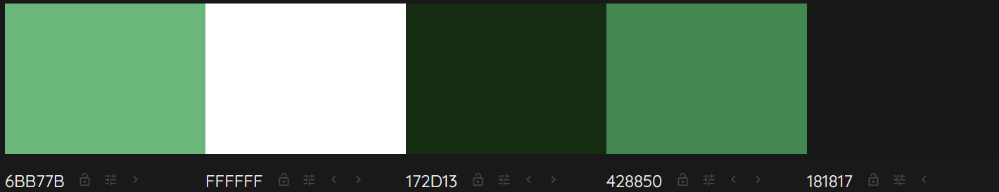
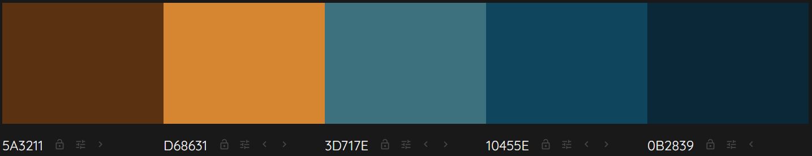

### Logo
* The 'Gugi' font is specified as the Logo font.

### Typography
* The 'lato' font is specified as the primary font, and the 'sans-serif' font is specified as a fallback font.

### Data Models
1. AllAuth User Model
    * Django Allauth, the User model is the default user model provided by the Django authentication system
    * The User entity has a one-to-many relationship with the Application entity. This means that a User can have multiple applications, but each application is associated with only one User.
2. Application Model
    * The Application model stores information related to job applications,
    including the position applied for, company details, application status, 
    and the method of application. Each application is linked to a specific user 
    through a foreign key relationship, allowing users to manage and track 
    their job applications effectively.
3. Contact Model
    * The Contact model is used to store contact information and messages submitted
    by users through a contact form. It includes the user's name, email address, 
    and the content of the message they wish to send.

4. About Model
    * The About model represents the information displayed in the "About" section of the ApplyWise application. This section is designed to provide users with an introduction to the developer and the purpose of the application, enhancing transparency and engagement.
5. ProfileImage
    * The ProfileImage model is designed to store the profile picture of a user in the application. This model is associated with Django's default User model through a one-to-one relationship, meaning each user can have only one profile image, and each profile image is tied to exactly one user.

### Database Scheme

Entity Relationship Diagram (ERD)
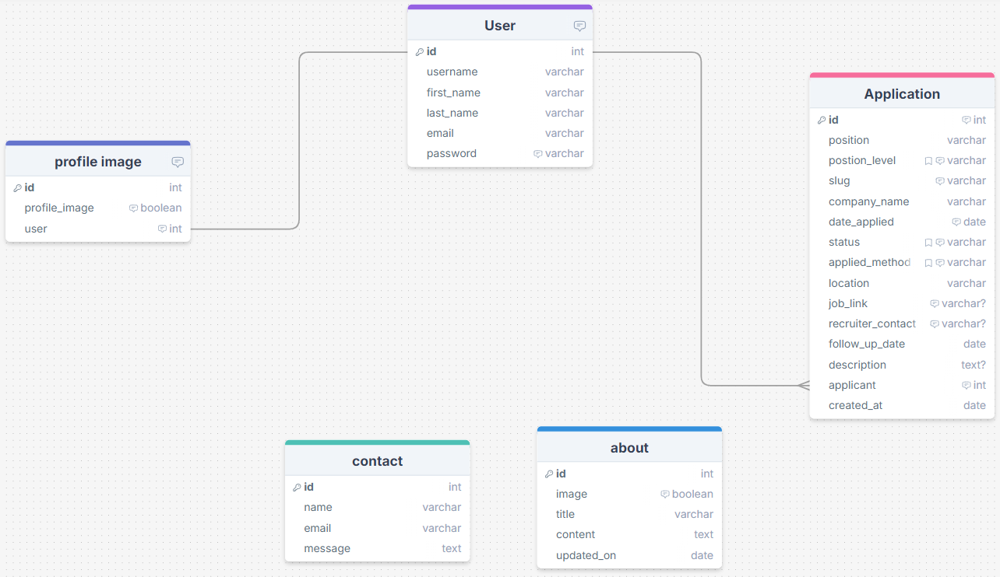

## Security Features

### User Authentication

* Django Allauth is a popular authentication and authorization library for Django, which provides a set of features for managing user authentication, registration, and account management.

### Login Decorator

* application_list, create_application, edit_application, delete_application, search_applications, and filter_apps: These views involve operations related to application creation and require authentication with the login_required decorator.
* This ensures that only authenticated users can access these views.

### CSRF Protection

* Django provides built-in protection against Cross-Site Request Forgery (CSRF) attacks. CSRF tokens are generated for each user session, and they are required to submit forms or perform state-changing actions. When a user logs out, the session and associated CSRF token are invalidated, making it difficult for an attacker to forge a valid request using a copied URL.

### Custom error pages

* 404 Error Page, provides user with a button the redirect to home page.

## Features

* ApplyWise is a robust web application that simplifies job application management, providing users with an intuitive platform to stay organized and improve their job search outcomes.

### Existing Features
* Secure registration, login, and logout functionalities ensure that users have private and convenient access to their data.
* * Account Creation Page
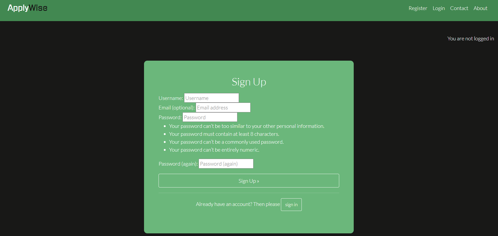
* * Logout Confirmation Page
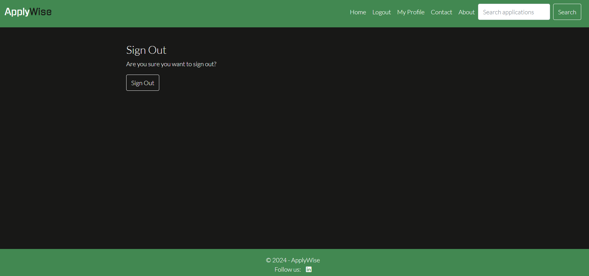
* * Login Page
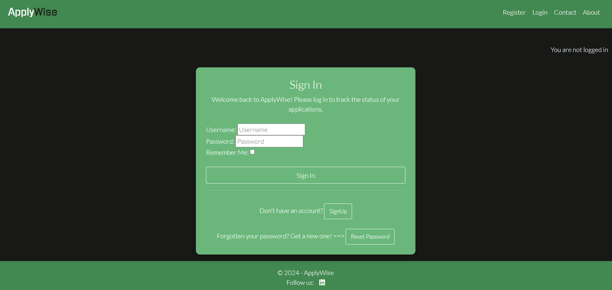

* Application Tracking: A centralized dashboard enables users to track the progress of all applications in one place, keeping them updated on status changes.
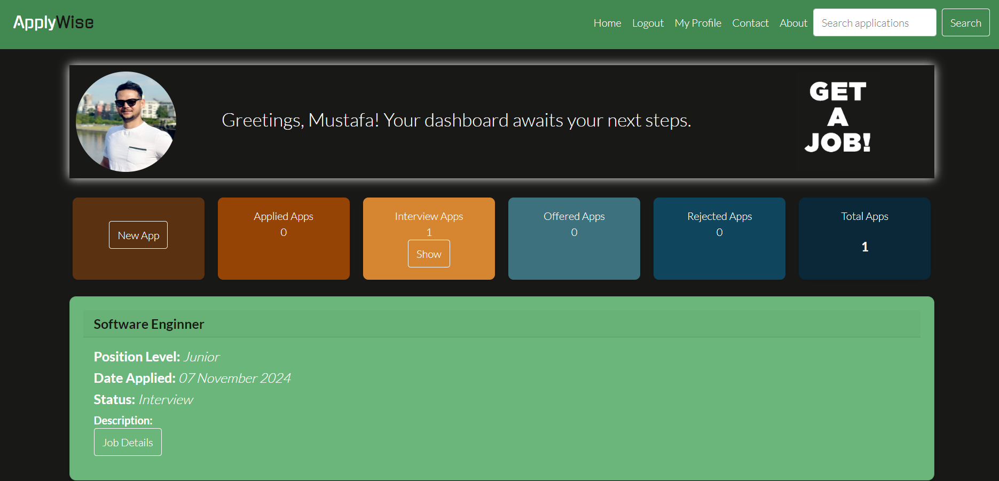

* Application Management: Users can create, update, and delete applications, including detailed information about positions, companies, and statuses.
* * Create Application
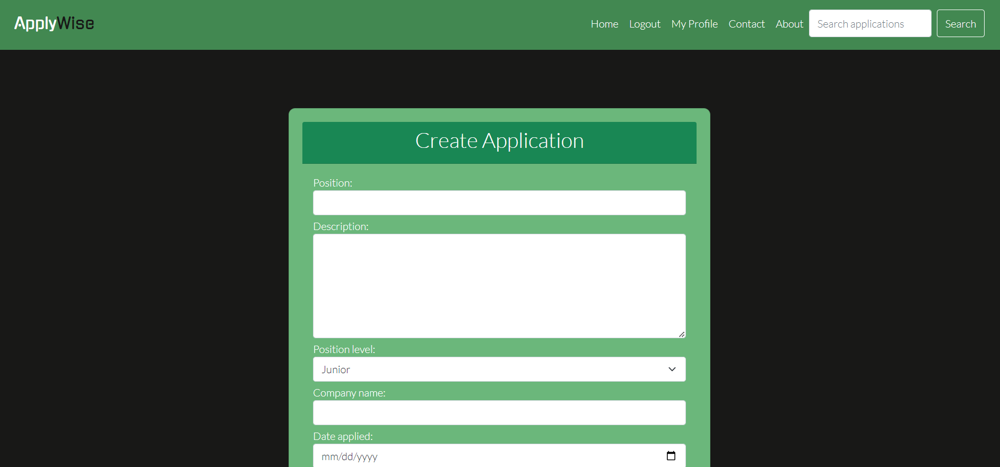
* * Edit Application
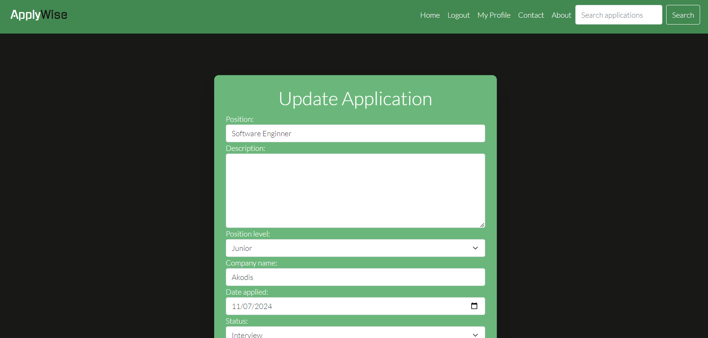
* * Delete Application
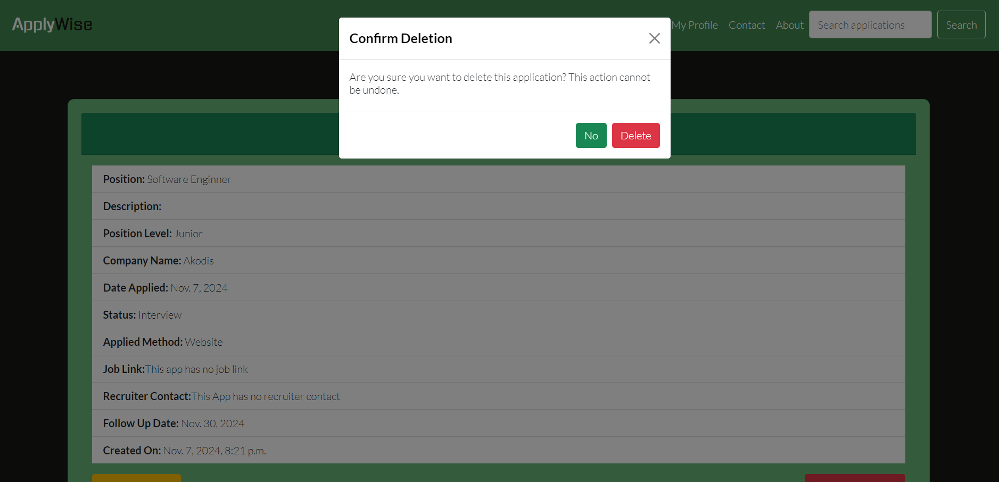

* Password Recovery: A "Forgot Password" option helps users quickly reset their passwords, allowing easy re-entry in case of forgotten credentials.
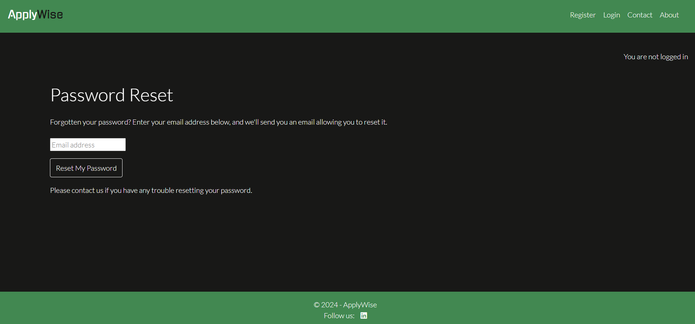

* Search, Filter, and Pagination: Users can efficiently locate applications with keyword search, filter by status (e.g., applied, interview, offered, rejected), and use pagination to browse applications with ease.
* * Search Apps
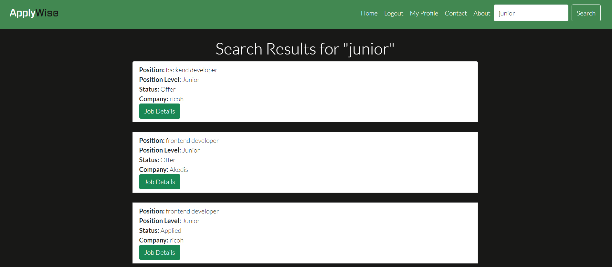
* * Filter Apps
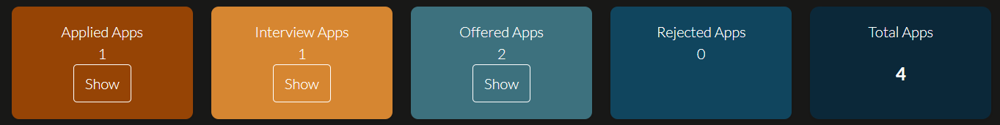
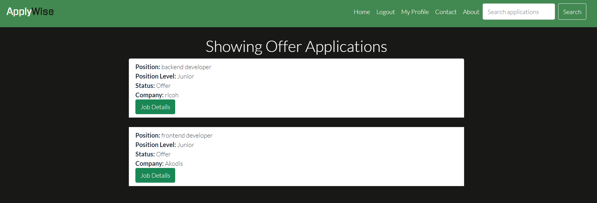
* * Pagination
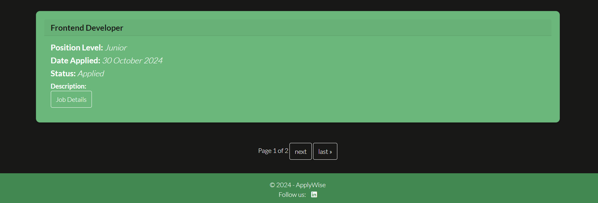
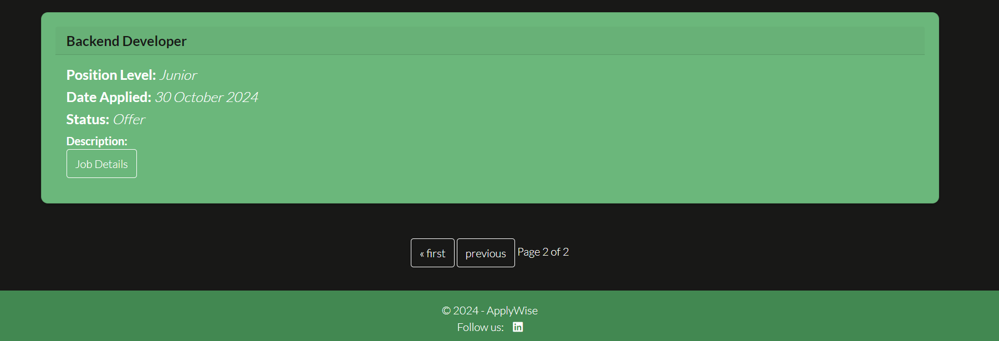
* Profile Customization: Personalize profiles with relevant details.
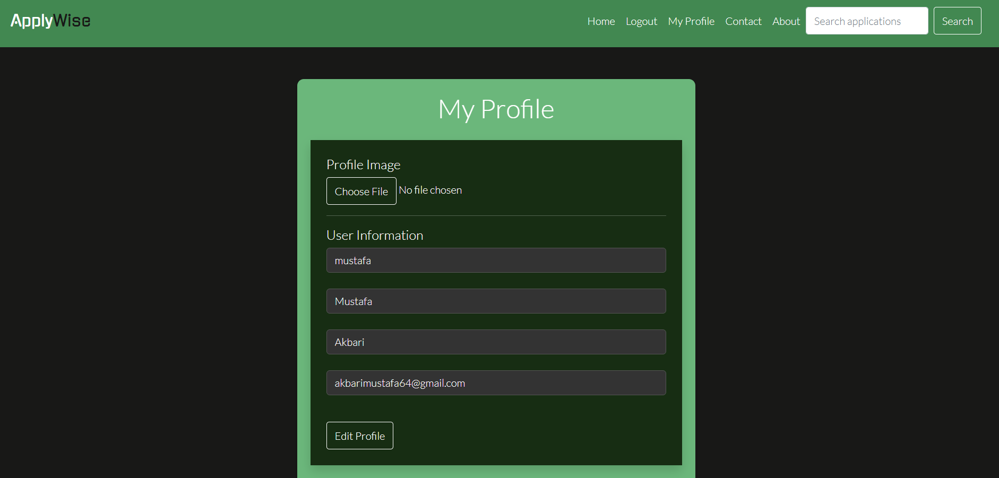
* Feedback Messages: Real-time feedback messages keep users informed of completed actions, such as updates and deletions.
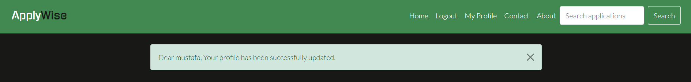
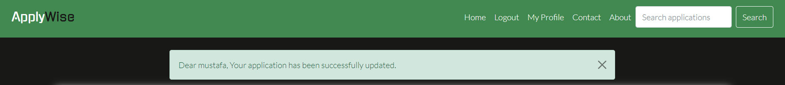
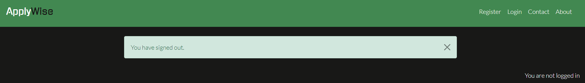
* Contact Page: Users can reach out for support or feedback using a contact form for timely assistance from the ApplyWise team.
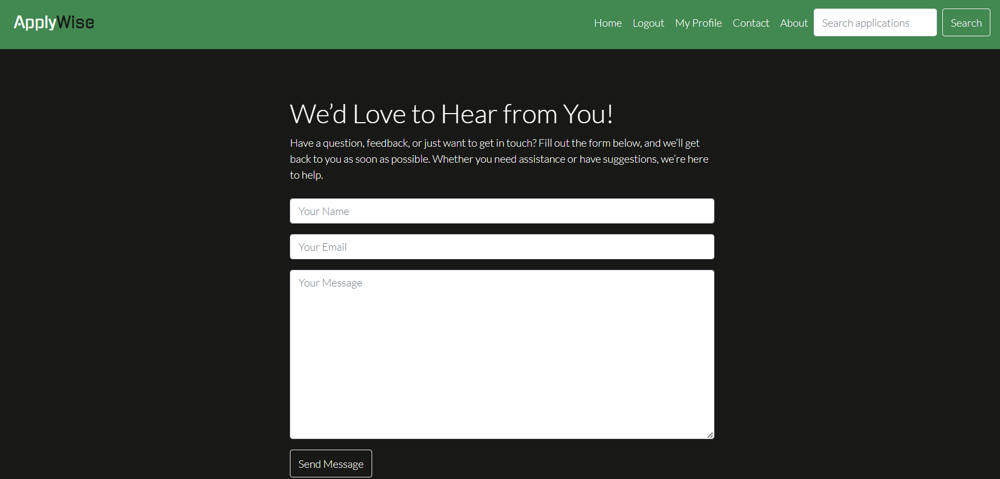
* About Page: Shares the mission and goals of ApplyWise, explaining how it empowers job seekers by enhancing their application management.
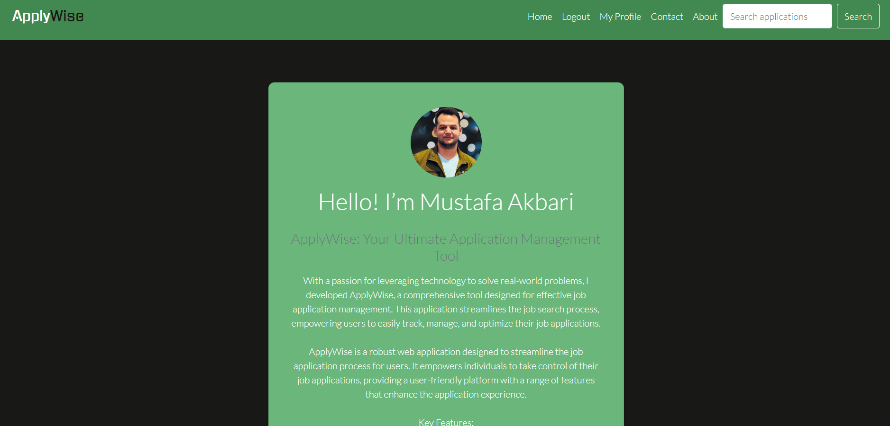

